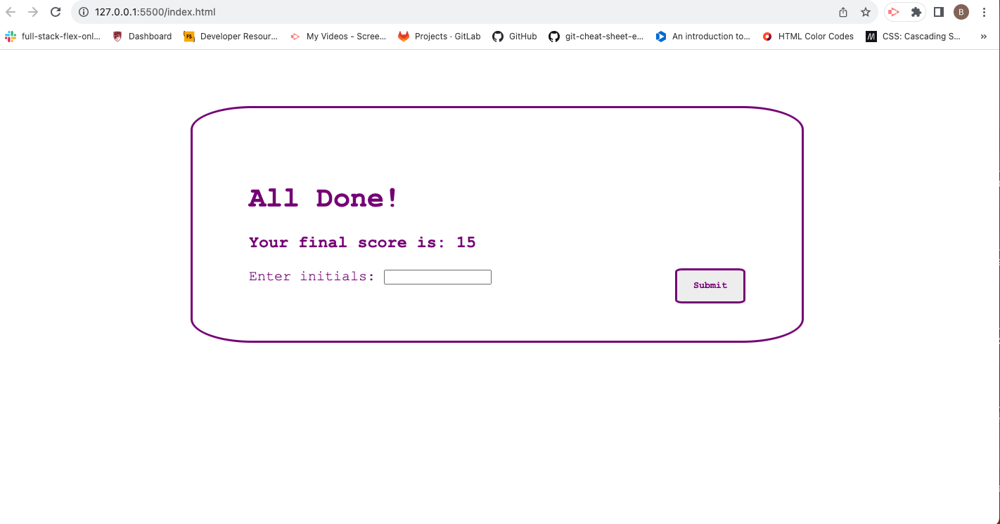

# Homework-4
Coding quiz!
User will select Start Quiz button which takes you to the first question and starts a timer.
If the user gets a question wrong they lose 10 seconds from their timer.
Wrong answers give you -5 points and Correct answers give you +5 points.
Enter your initals at the end, Submit them, and you can view the past scores of other users as well

# Preview of Quiz

# Link to the Quiz!

[Quiz!](https://bryncidently.github.io/Homework-4/)